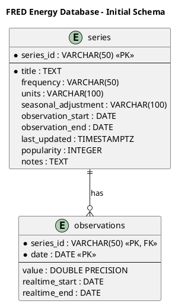

```plantuml

@startuml

title FRED Energy Database - Initial Schema

entity "series" as series {
    * series_id : VARCHAR(50) <<PK>>
    --
    * title : TEXT
    frequency : VARCHAR(50)
    units : VARCHAR(100)
    seasonal_adjustment : VARCHAR(100)
    observation_start : DATE
    observation_end : DATE
    last_updated : TIMESTAMPTZ
    popularity : INTEGER
    notes : TEXT
}

entity "observations" as observations {
    * series_id : VARCHAR(50) <<PK, FK>>
    * date : DATE <<PK>>
    --
    value : DOUBLE PRECISION
    realtime_start : DATE
    realtime_end : DATE
}

series ||--o{ observations : "has"

@enduml

```
